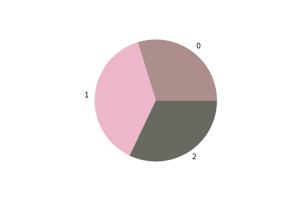

# HardHat/Head Detection

## 1. EfficientDet and it's Structure:

*  This application of object detection has three main stages:

      a.   **EfficientNet**  
      b.   **BiFPN(Bi-directional feature pyramid network)**  
      c.   **Bounding Box/Classification Heads** 
 
<p align="center">
  
</p>

### a. EfficientNet:

* Backbone architectures are very important for an object detection module, whose job is to make features more significant for detection. 
* There are various approches by which these backbones attain efficiency in producing features. Out which is incresing width(feature channels), depth(adding more layers) and resolution, is common practice.

<p align="center">
  
</p>

**Fig: Effect of increasing width, depth and resolution.**

* So efficientnet focuses on increasing these parameters with a constant ratio. [Refer](https://arxiv.org/pdf/1911.09070) it's paper to know ow it's done.

* It's basic structure is shown below:

<p align="center">
  
</p>

* **MB Convs:** Input -> 1 x 1 Conv op -> 3 x 3 Depthwise Conv op -> 1 x 1 Conv + Input

<p align="center">
  
</p>

### b. BiFPN:

* When we look at FPN network,s every node has one outward connection with every other node in the network. 

* Hence every node would have less contribution to the performance of the network. 

* To gain over this drawback, the paper introduces bi-direction feature pyramid network to get more accuracy. [Refer](https://arxiv.org/pdf/1911.09070) it's paper to know more.

<p align="center">
  
</p>


### c. Classification and Detection Head:

* After FPN layer, output features are passsed to 2 different heads deployed for classification and detection which give out confidence score and bbox offsets. 


## 2. Why choose efficientdet ?

* The idea is simple over here. When accuracy is the only goal, then deeper and heavier networks like Faster-RCNN would perform with precise accuracy and recall.

* On the other hand, if the goal is speed, then MobilenetV2-ssd , YOLO-tiny variants will do the job. But if it's both, then EfficientDet is preferrable.

* To play safe with not much of a tradeoff between accuracy and speed, EfficientDet was chosen.

## 3. KMeans Clustering for Color Detection:

* The algorithm is a unsupervised learning method, which works in four basic steps:

    1. Assigns random centroids in n-dimensional space(based on features).
    2. Calculates distances of every datapoint's distance from these centroids.
    3. Assigns datapoint to a centroid's group whose distance is compartively lesser than other points.
    4. After assigning all datapoints. Centroid group's mean is considered as new point.

* K value is set by the user. 
 
<p align="center">
  
</p> 

* Here for this problem, kmeans centroids are the color pixels present in the image. So centroids are used in the calculation of hardhat/helmet color present in the detected bounding box.(K=3)

* Consider the image below:
<p align="center">
  
</p> 

* When k=3, this image had 3 grps of colors.

<p align="center">
  
</p>

* When we see the pie chart above, the algorithm detects 3 dominant colors in the image. So instead of choosing one color from the detection, the colors are averaged and euclidean distance is calculated with RED,BLUE,GREEN and YELLOW colors.

* Pink has is slightly nearer to red pixel, hence it's values are considered at the end for the above image.

## 4. Training and Inferenece:

* Refer the colab over [here](https://github.com/rahulmangalampalli/EfficientDet0-Hardhat-Detection/blob/main/Efficiendet_head%2Bhelmet.ipynb) to train the model

### Inference

* Clone this repository.

```bash
cd $ROOT/EfficientDet0-Hardhat-Detection
!pip install -r requirements.txt
!unzip models.zip
!rm models.zip
```
* Download fine_tuned_model folder from [here]().

* Inference with this command:
```bash
python inference.py /path/to/image /path/to/model_folder
```
* Inference video:
```bash
python infer_vid.py /path/to/image /path/to/model_folder
```
